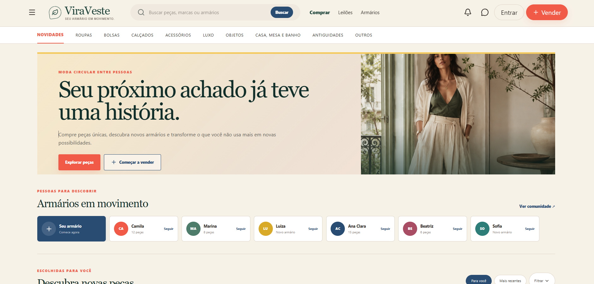
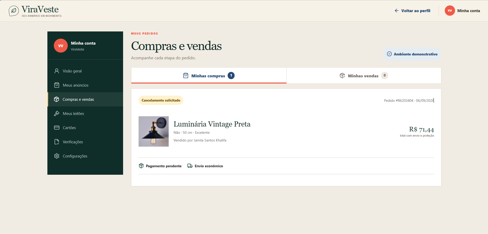

# ViraVeste

Marketplace brasileiro de produtos de segunda mão com vendas diretas e leilões.

**Projeto autoral de Jamila Khalifa, em desenvolvimento.**

## Prévia do projeto

Capturas do protótipo em desenvolvimento, executado localmente no computador.

### Página inicial



### Acesso à conta


### Compras e vendas — ambiente demonstrativo



Os dados de pedido, valores e estados apresentados nesta última captura pertencem ao fluxo demonstrativo. A imagem não comprova processamento de pagamentos ou operação comercial real.

## Estado atual

O projeto contém a interface completa do protótipo, autenticação pelo Supabase,
perfil real, endereços persistentes e uso do endereço cadastrado no checkout.
Produtos, pedidos, pagamentos, mensagens e leilões ainda utilizam dados
demonstrativos e serão conectados ao banco gradualmente.

## Requisitos

- Node.js 22.13 ou superior
- Visual Studio Code
- Conta e projeto no Supabase
- Git e, opcionalmente, GitHub Desktop

## Abrir no computador

1. Extraia a pasta do projeto.
2. Abra a pasta `viraveste` no Visual Studio Code.
3. No terminal do VS Code, execute:

```bash
npm install
```

4. Duplique o arquivo `.dev.vars.example` e renomeie a cópia para `.dev.vars`.
5. Preencha no `.dev.vars` a URL e a chave publicável do Supabase.
6. Inicie o projeto:

```bash
npm run dev
```

7. Abra o endereço local indicado no terminal, normalmente
   `http://localhost:5173`.

## Banco de dados

Os arquivos SQL estão em `supabase/migrations` e devem ser executados em ordem:

1. `001_create_profiles.sql`
2. `002_create_addresses.sql`

Essas migrações configuram também as políticas de segurança para que cada
usuário acesse apenas os próprios dados.

## Comandos úteis

```bash
npm run dev
npm run build
npm run lint
```

## Segurança

- Nunca publique `.dev.vars`, `.env` ou chaves secretas.
- A chave publicável do Supabase pode ser usada pelo aplicativo, mas deve ser
  combinada com políticas RLS bem configuradas.
- Nunca coloque a `service_role` no navegador ou no GitHub.
- Pagamentos e fretes reais só devem ser ativados depois das validações de
  segurança e das regras jurídicas do marketplace.

## Estrutura principal

- `app/`: páginas e rotas da aplicação
- `app/api/`: endpoints protegidos usados pelo site
- `public/`: imagens e arquivos públicos
- `supabase/migrations/`: estrutura versionada do banco
- `components/`: componentes reutilizáveis

## Próximas etapas

1. Completar todas as páginas e estados de navegação.
2. Criar as tabelas de produtos e imagens.
3. Conectar anúncios, favoritos e perfis públicos.
4. Criar pedidos, mensagens, avaliações, leilões e lances.
5. Integrar pagamentos, logística e painel administrativo.

## Tecnologias

React · TypeScript · Tailwind CSS · Supabase · Vite · Vinext · Drizzle ORM

O projeto utiliza a estrutura de rotas do Next.js e scripts de desenvolvimento e build com Vite/Vinext, conforme o `package.json`.

## Autoria

Desenvolvimento individual por **Jamila Khalifa**.

[Portfólio](https://portfolio-jamila-khalifa.netlify.app/) · [GitHub](https://github.com/jalkhalifa)

Todos os direitos reservados. A disponibilização pública do repositório não concede automaticamente uma licença de reutilização.
